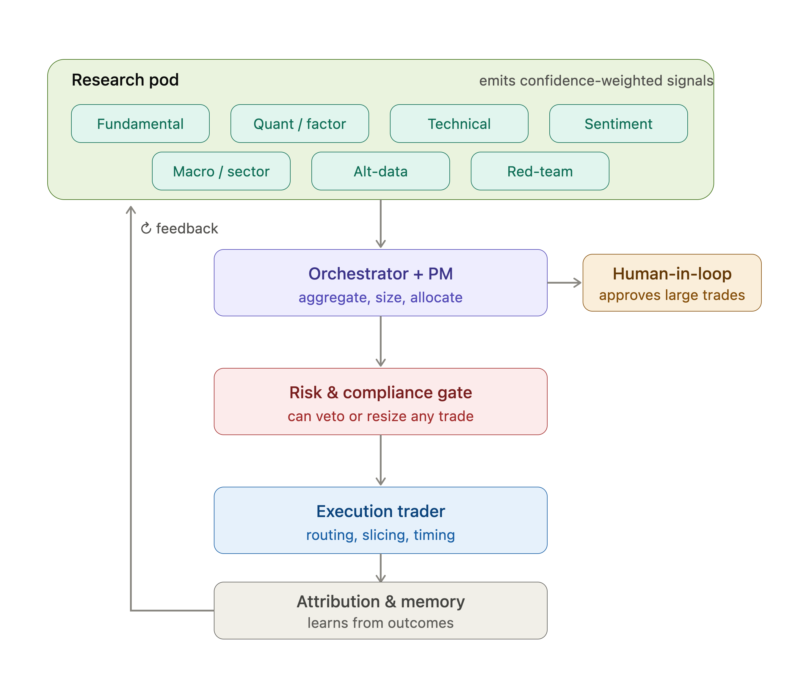

Here's a roster modeled on how a top-tier institutional desk actually divides labor — research, portfolio construction, risk, execution, and governance — translated into discrete agents. I've organized them into functional pods, since the value of a multi-agent system comes as much from the *separation of authority* (especially giving risk and compliance veto power) as from the individual roles.

## Orchestration / Governance

**CIO / Portfolio Orchestrator** — Owns the mandate: return target, risk budget, tech-sector tilt, cash policy. Allocates capital across strategy "sleeves," arbitrates conflicting signals from the research pod, and is the single point of human-in-the-loop escalation. This is your top-level orchestrator agent.

**Portfolio Manager** — Translates strategy into concrete target weights and position sizing. Runs the rebalancing logic, decides *when* a signal is strong enough to act, and manages the trade-off between conviction and diversification.

## Research & Signal Generation (the analyst pod)

**Fundamental Analyst** — Earnings quality, financial statements, valuation (DCF, multiples). For tech specifically: revenue growth durability, gross margin trajectory, R&D intensity, and SaaS metrics like net revenue retention, ARR growth, and CAC/LTV.

**Quantitative / Factor Analyst** — Factor exposures (momentum, quality, value, size, low-vol), statistical modeling, and backtesting. Keeps the portfolio's factor loadings intentional rather than accidental.

**Technical Analyst** — Price action, trend, momentum, support/resistance, and volume — primarily for entry/exit timing rather than the core thesis.

**Sentiment & News Analyst** — NLP over news, filings, social feeds, and earnings-call transcripts to detect narrative shifts, guidance changes, and tone. Tech moves hard on forward guidance, so this pairs tightly with the fundamental agent.

**Macro & Sector Strategist** — Rates, liquidity, the semiconductor cycle, AI-capex cycle, and regulatory/antitrust risk. Tech is long-duration and rate-sensitive, so this agent sets the sector-level risk-on/risk-off posture.

**Alternative Data Analyst** — App downloads, web traffic, job postings, patent filings, GitHub/commit activity, supply-chain signals. This is where a tech portfolio gets a genuine edge over consensus.

## Risk & Compliance (the guardrails — these have *veto authority*)

**Risk Manager** — VaR, drawdown limits, concentration and correlation caps, stress tests, and scenario analysis. Can block or downsize any trade that breaches the risk budget, regardless of conviction. In tech this matters doubly because names are highly correlated (a "7 stocks, 1 bet" problem).

**Compliance / Guardrail Agent** — Position limits, restricted lists, wash-sale and pattern-day-trading rules, and hard constraints on anything resembling material non-public information. A deterministic gate, not a probabilistic one.

## Execution

**Execution Trader** — Order routing, slicing (TWAP/VWAP), timing, and slippage minimization. Takes an approved target from the PM and works the order to minimize market impact rather than dumping it at market.

## Support & Meta (the flywheel)

**Performance Attribution Analyst** — Decomposes P&L into factor, sector, selection, and timing contributions so the system learns *why* it won or lost, not just that it did.

**Tax Optimizer** — Tax-loss harvesting, holding-period and lot-selection optimization (relevant if this is a taxable account).

**Red-Team / Devil's Advocate** — Deliberately argues the bear case against every high-conviction position, checks for groupthink across the research pod, and surfaces what would have to be true for the thesis to be wrong. Underrated and worth having as a distinct adversarial agent rather than a personality prompt.

**Decision Journal / Memory** — Logs every decision with its rationale and the state that produced it, so the orchestrator can review calibration over time and feed lessons back into the research pod.

## How they work together

The critical design choices are less about the roster and more about authority and flow:

The research pod runs a **Perceive → Reason** loop, each agent emitting a *scored, confidence-weighted signal* with its rationale rather than a raw buy/sell. The PM aggregates these (a debate/consensus step where the Red-Team agent gets a formal seat). The orchestrator sizes the decision — and then **every proposed trade passes through the risk and compliance gate, which can veto or resize but never originate trades**. Only after clearing the gate does execution act. Separating signal-generation from risk-approval from execution is what keeps a single over-confident model from blowing up the book.

I'd also strongly recommend a **human-in-the-loop checkpoint** at the orchestrator level for any trade above a size/risk threshold — the same way a real desk has limits above which a human PM must sign off.

Here's the topology and signal flow:Here's how those roles connect — the signal flow through the pods, with the risk-and-compliance gate as the mandatory checkpoint between decision and execution:

A few practical notes if you're actually going to build this:

The confidence-weighted signal format is the linchpin. Have each research agent emit a structured object — direction, conviction score, time horizon, and a short rationale — rather than a raw recommendation. That lets the orchestrator do principled aggregation (e.g., a Bayesian or weighted-ensemble blend) and lets you attribute P&L back to specific agents later, which is how the flywheel actually improves over time.

The risk and compliance gate should be at least partly *deterministic* rather than another LLM call. Position limits, restricted lists, and wash-sale checks are rules you want enforced with certainty, not probabilistically. Reserve the model-based reasoning for the softer judgments like correlation regime shifts or "is this concentration thesis still intact."

For a tech portfolio specifically, the two agents that earn their keep are the macro/sector strategist (tech is long-duration and rate-sensitive, so it moves as a bloc) and the alt-data analyst (where you'd find an edge over consensus). The others are table stakes.

One important caveat: fully autonomous trading carries real financial and regulatory risk, and I'm not a financial advisor — this is an architecture, not investment advice. I'd strongly suggest running any such system in paper-trading/simulation for a long while, with a hard human approval gate above a meaningful size threshold, before it ever touches real capital.

Want me to go deeper on any one agent — say, the exact signal schema and aggregation logic for the orchestrator, or a reference implementation sketch using an agent framework and MCP for the data/execution tooling?
